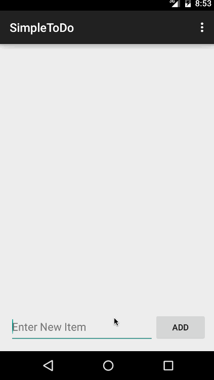

Project 0: SimpleToDo
==========
This is Simple To Do android application. This app allows to create a to do items , edit them and delete them. 

Time spent: 4 hours spent in total

Completed user stories:

 * [x] Required: User can view a list of items in the to do list. 
 * [x] Required: User can add a item to the to do list. 
 * [x] Required: User can edit a item in the to do list. 
 * [x] Required: User can delete a item in the to do list. 
 

1. Adding Item
-----------
* Launch the app. 
* Enter the item in the text field.
* Click the "Add" Button.

2. Editing Item
-----------
* Launch the app.
* Click on the item to be edited. 
* It will take you to a news screen. 
* Edit the text as needed. 
* Press the "Save" Button.

3. Deleting Item.
-----------
* Launch the app.
* Long press the item to be deleted. 
* Item will be deleted. 

Walkthrough of all user stories:

GIF created with [LiceCap](http://www.cockos.com/licecap/).

